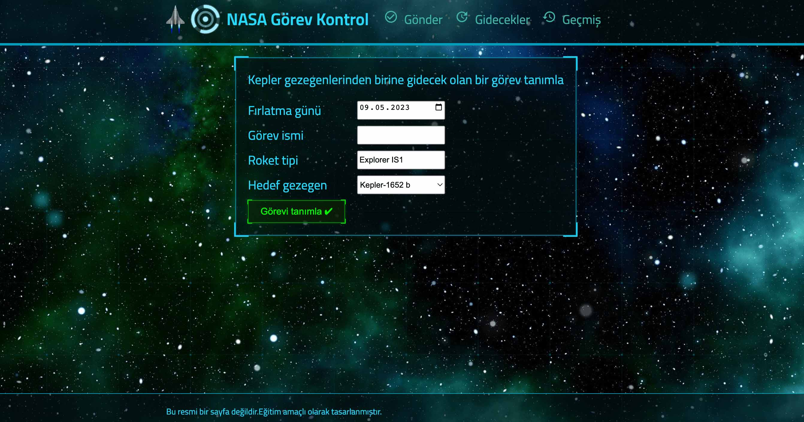
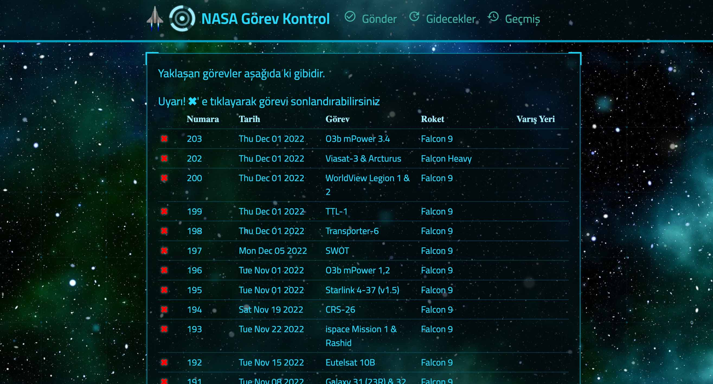
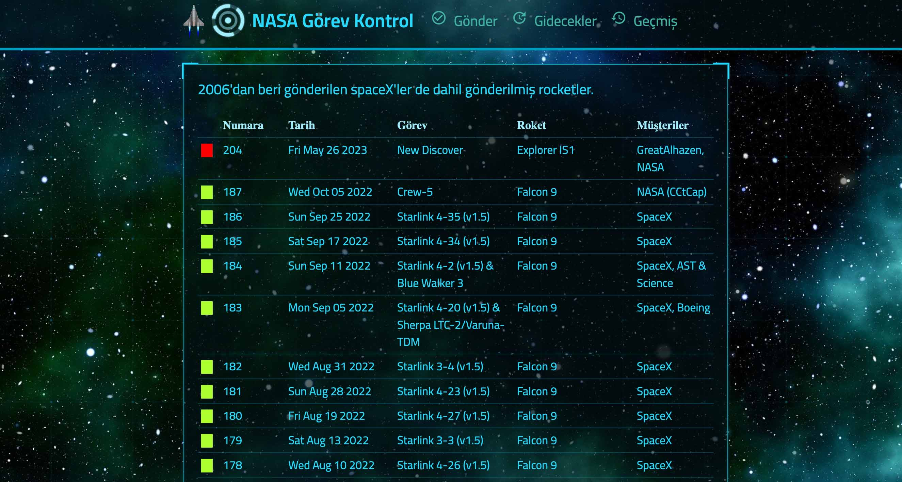

# [Full Stack NASA Launchs Project](https://nasa-flights.onrender.com/)

|             Main              |             Flights              |
| :---------------------------: | :------------------------------: |
|  |  |

|             History              |
| :------------------------------: |
|  |

Amazing full stack website build with react and node.js

## Links:

- [Live Preview](https://nasa-flights.onrender.com/)

## Installation

- Clone the repo:

```
git@github.com:greatAlhazen/Full-Stack-Project.git
```

- Get into main directory and execute this command

```
npm run install-app
```

- In the backend directory create .env file and specify these

```
MONGO_URL=<YOUR_MONGO-DB_URL>
PORT=<YOUR_PORT>
```

- After,get into terminal and execute this command for watch

```
npm run watch
```

- After those, get into browser and go to specified http://localhost:<YOUR_PORT>

- for deployment get into terminal and execute this command

```
npm run deploy-app
```

## Docker

- Clone the repo:

```
git clone git@github.com:greatAlhazen/Turkish-Cuisine.git
```

- Firstly,ensure you have latest version of docker - [installation](https://docs.docker.com/engine/install/)

- After,in the main directory run these commands in order:

```
docker build -t <YOUR_NAME> .
```

```
docker run -it -p <YOUR_PORT:8080> -t <YOUR_NAME>
```

- After those, get into browser and go to specified http://localhost:<YOUR_PORT>

- Clone the repo:

## Copyright

Copyright 2023 [Enes Uraz](https://github.com/greatAlhazen)
